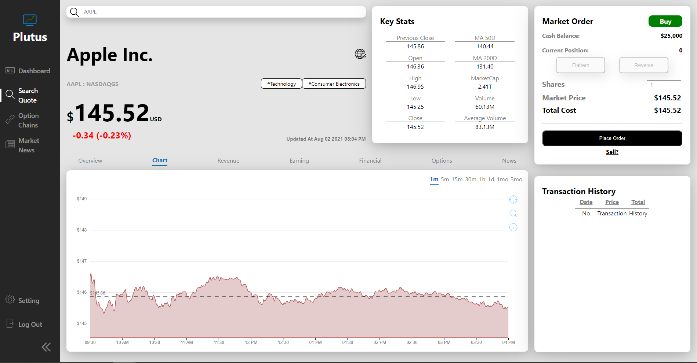

# Plutus 

A Stock Trading Simulator 📈 built using MERN stack!

## 👀Preview



## ✨Features

-   Buy & Sell Stock During The Market Hours
-   Stock's Price Chart With Differnt Time Interval
-   Stock's Financial Information and Other Key Stats
-   Option Chains Data With Different Expiration Date
-   Market News of The Day
-   Watch List (Coming Soon❗)
-   BackTesting (Coming Soon❗)

## 👨‍💻Development

### Clone Code

```sh
$ git clone https://github.com/Kelvin-Hui/Plutus
```

### Dev Mode

```sh
$ npm run start
```

### Build Mode

```sh
$ cd client && npm run build
```

### Start Server

```sh
$ cd server && node server.js
```

## 🔨Built with

-   [MongoDB](https://www.mongodb.com/)
-   [Express](https://expressjs.com/)
-   [React](https://reactjs.org/)
-   [NodeJS](https://nodejs.org/en/)
-   [D3.js](https://d3js.org/)
-   [Redis](https://redis.io/)

## 📄License

MIT © [Kelvin Hui](http://KelvinHui.me)
